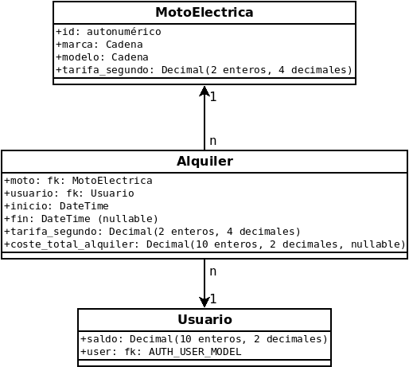

[](https://classroom.github.com/a/P1dpeex0)


# PTP-UD04 - MODELOS

La aplicación trata la gestión del aquiler de motos eléctricas con una
facturación por segundos.

Para elaborar la siguiente prueba teórico-práctica se pide implementar
en la carpeta de la app ptpupd04 las siguientes funcionalidades.

<!-- TOC -->
- [PTP-UD04 - MODELOS](#ptp-ud04---modelos)
  - [1. Implementación de Modelos](#1-implementación-de-modelos)
  - [2. Registra los modelos creados en Django-admin](#2-registra-los-modelos-creados-en-django-admin)
  - [3. Informes](#3-informes)
  - [4. Crea páginas para la gestión del alquiler de motos.](#4-crea-páginas-para-la-gestión-del-alquiler-de-motos)
<!-- TOC -->

## 1. Implementación de Modelos


**MUY IMPORTANTE:** Para poder afrontar los apartados 3 y 4, previamente este apartado debe
quedar resuelto y comprobado mediante la carga del fixture dump_profesorado.json

```
rm db.sqlite3
rm ptpud04/migrations/0*
python manage.py migrate
python manage.py loaddata dump_profesor.json
python manage.py createsuperuser [username]
```

Si quieres hacer pruebas y usar los usuarios en el dump puedes
cambiar sus contraseñas con el comando:
```
python manage.py changepassword {username}
```


**Implementa los modelos reflejados en la siguiente imagen**
y realiza la migración para crear las tablas
en la base de datos SQLite. Considera si deberías enlazar a
tus modelos alguno de los que el propio framework Django
ofrece como base.



**ERRATA:** El campo coste_total_alquiler de Alquiler, debe llamarse coste_total

## 2. Registra los modelos creados en Django-admin
Registra los modelos creados en Django Admin para que se puedan
gestionar los datos desde allí de forma sencilla.

## 3. Informes

**RECOMENDACIÓN:** Carga el dump_profesor.json antes de este apartado. Se
va a corregir con los datos en él contenidos.

1. Informe top 5 Motos.
   1. **URL:** localhost:8000/informes/**top5_motos** 
   2. Muestra ordenados las 5 motos más veces alquiladas
2. Informe Maestro/Detalle. 
   1. **URL:** localhost:8000/informes/**maestro_detalle** 
   2. Parte superior de la página Formulario de filtro
      1. Campo de texto: Marca/Modelo Filtra por coincidencia de
         texto de ambos campos total o parcialmente.
      2. RadioSelect: Alquiladas/Libres filtra por estado de la 
         moto según esté alquilada o libre.
   3. Parte inferior muestra todas las motos en una tabla según
      coincidan o no con el filtro seleccionado.

## 4. Crea páginas para la gestión del alquiler de motos.

1. **URL:** localhost:8000/**alquila**/_\<idmoto>_
    1. Si el id pasado pertenece a una moto existente y la petición
       es de **tipo GET**, se carga una página con los detalles de la moto y un botón para confirmar el aquiler.
       1. Si la moto ya está alquilada, no se debe mostrar el botón
       para enviar el formulario y mostrar un mensaje que indique
       que la moto ya está alquilada.
       2. Igualmente, si la moto está disponible pero el usuario
       no dispone de un saldo mínimo de 10€, NO se debe mostrar
       el botón para enviar el formulario y mostrar un mensaje 
       que indique saldo no suficiente. Esto implica que el usuario
       ha debido iniciar sesión para acceder a la URL.
       3. Si la moto está disponible se debe mostrar el botón de envío     para el formulario **tipo POST**. Al confirmar, se debe crear una entrada en la tabla de alquiler para el usuario logado y la moto seleccionada con la fecha de inicio y la tarifa por segundo del momento de la reserva. Tras el alta del alquiler se debe redirigir al url con name='welcome'.
    2. Si la moto no existe se debe lanzar un **404**
2. **URL:** localhost:8000/**libera**/_\<idmoto>_
   1. Las peticiones a esta view se hacen por get.
   2. Si la moto no existe se debe lanzar un 404
   3. Para poder cosultar el view es obligatorio estar logado,
      de no estarlo el usuario debe ser redirigido a una página
      de autenticación (No hace falta implementarla).
   4. Si la moto no está alquilada, o el usuario que hace la petición 
      no es el usuario que la tiene alquilada, 
      se debe hacer un raise de una excepción de tipo Http404.
   5. Si la moto está actualmente alquilada por el usuario que
      realiza la petición. 
      1. Se deben completar los campos de fecha_fin y coste_total 
         **(Redondeando al alza para el céntimo)**.
         _Además, se debe restar el total del saldo del usuario_.
      2. Como resultado se muestra una página de reserva finalizada a través del template en el archivo `free.html`